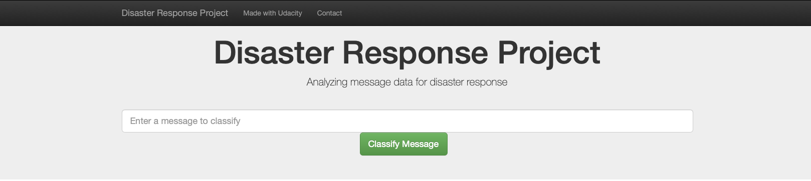
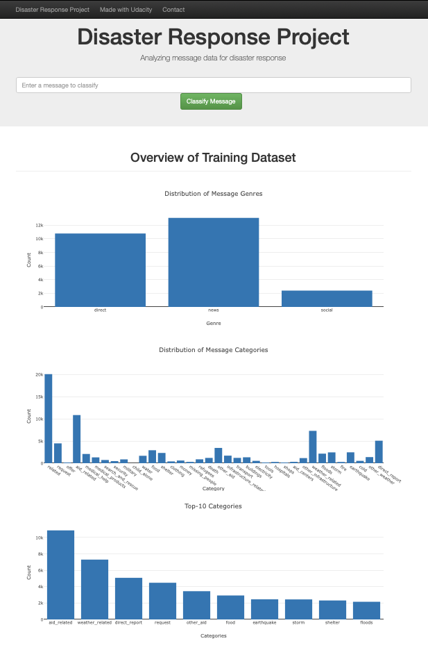
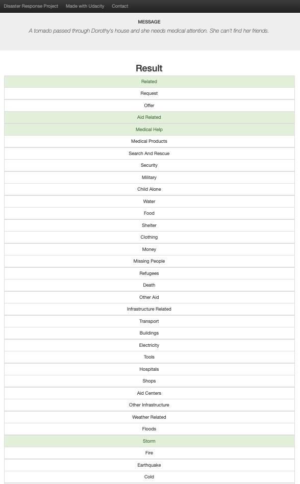

# Disaster Response Pipeline Project



## Table of Contents
1. [Description](#project_overview)
2. [Getting Started](#getting_started)
	1. [Dependencies](#dependencies)
	2. [Installing](#installing)
	3. [Executing Program](#executing)
	4. [Notes](#notes)
3. [Authors](#authors)
4. [License](#license)
5. [Acknowledgement](#acknowledgement)
6. [Screenshots](#screenshots)

<a name="project_overview"></a>
## Project Overview

This Project is part of Data Science Nanodegree Program by Udacity in collaboration with Figure Eight.
The purpose of this project is to build a natural language processing (NLP) app that categorize text and tweet messages during a disaster. The data includes prelabeled tweet and messages from real-life disasters. By categorizing these messages into events, the messages can be relayed to an appropriate disaster relief agency.   


The project consist 3 parts:

1. Data Processing: ETL Pipeline to extract data from source, clean data, and save them in a database structure.
2. Implement a machine learning pipeline to train a model to categorize the messages based on the disaster (or event)
3. Develop a web app to show the model results in real time. 

<a name="getting_started"></a>
## Getting Started

<a name="dependencies"></a>
### Dependencies
* Python 3, NumPy, Pandas, Scikit-Learn, NLTK, SQLAlchemy, Flask, Plotly

<a name="installing"></a>
### Installing
Clone this GIT repository:
```
git clone https://github.com/geovani-montoya/Udacity-DSND_Disaster_Response_App
```
<a name="executing"></a>
### Executing Program:
1. Run the following commands in the project's root directory to set up your database and model.

    - To run ETL pipeline that cleans data and stores in database
        `python data/process_data.py data/disaster_messages.csv data/disaster_categories.csv data/DisasterResponse.db`
    - To run ML pipeline that trains classifier and saves
        `python models/train_classifier.py data/DisasterResponse.db models/classifier.pkl`

2. Run the following command in the app's directory to run your web app.
    `python run.py`

3. Go to http://0.0.0.0:3001/

<a name="notes"></a>
### Notes
You may run this regular desktop/laptop but the ML Pipeline (training) might take several hours. 

<a name="authors"></a>
## Authors

[Geovani Montoya](https://github.com/geovani-montoya)

<a name="license"></a>
## License
[](https://opensource.org/licenses/MIT)

<a name="acknowledgement"></a>
## Acknowledgements

* [Udacity](https://www.udacity.com/) extensive curriculum in Data Science Nanodegree Program
* [Figure Eight](https://www.figure-eight.com/) provided messages dataset

<a name="screenshots"></a>
## Screenshots

This is a view of the website home page. It contains three graphs showing basic information about the data being used for the web app.



Type in a message and click the "Classify Message" button and it will highlight the categories that the message best fits into. 




